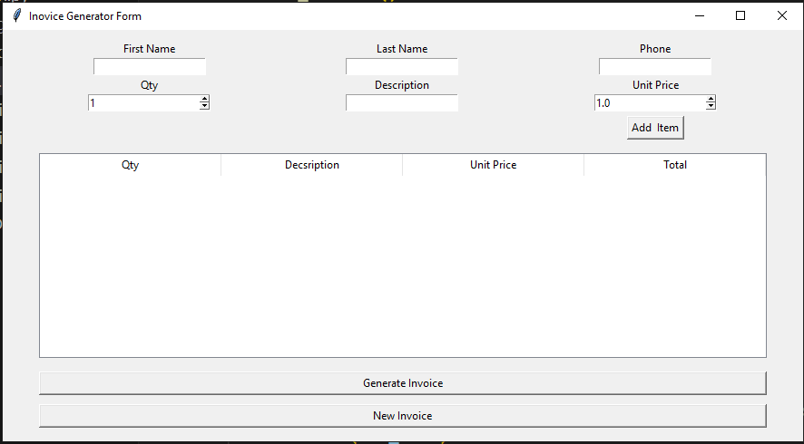

# 🧾 Tkinter Invoice Generator

A desktop-based Invoice Generator application built with **Python's Tkinter** and **DocxTemplate**.  
This tool allows you to input customer and item details, dynamically add them to an invoice, and export a `.docx` invoice document.

---

## 🚀 Features

- 👤 Customer information input (First name, Last name, Phone number)
- 🧮 Add multiple invoice items with quantity, description, and unit price
- 📑 Invoice preview using a `Treeview` table
- 📤 Generates `.docx` invoice using `invoice_template.docx`
- 🧹 "New Invoice" resets form for the next customer
- 💬 Messagebox alerts for invoice confirmation

---

## 🛠 Technologies Used

- Python 🐍
- Tkinter (GUI)
- `docxtpl` (for Word document generation)
- `datetime` (for timestamping invoice files)
- `messagebox` (for success notifications)

---

## 📦 How It Works

1. **Enter customer details**: First name, last name, and phone number.
2. **Add items**: Enter quantity, item description, and unit price.
3. **Click “Add Item”**: Item appears in the invoice preview.
4. **Click “Generate Invoice”**:
   - Totals are calculated automatically.
   - A `.docx` invoice file is generated using the template.
5. **Click “New Invoice”** to start a new one.

---

## 📁 Project Structure

```
invoice_generator/
│
├── invoice_template.docx    # Word template with placeholders
├── invoice_app.py           # Main Python application
├── README.md                # Project documentation
```

---

## 📌 Notes

- The invoice is calculated with a **10% sales tax** subtracted from the subtotal.
- Generated invoices are saved with a timestamp in the filename.
- Ensure `invoice_template.docx` is formatted properly with Jinja2 tags like `{{ name }}`, `{{ phone }}`, `{{ invoice_list }}`, etc.

---

## 📸 Screenshot



---

## ✅ Requirements

Install dependencies using:

```bash
pip install docxtpl
```

---

## 👤 Author

**Mian Arham Haroon**  
📌 [GitHub](https://github.com/mian-arham-haroon)  
🌐 [Portfolio](https://mian-arham-haroon.github.io/arham_portfolio)

---

Feel free to use, modify, and extend the project. Contributions are welcome! 🌟